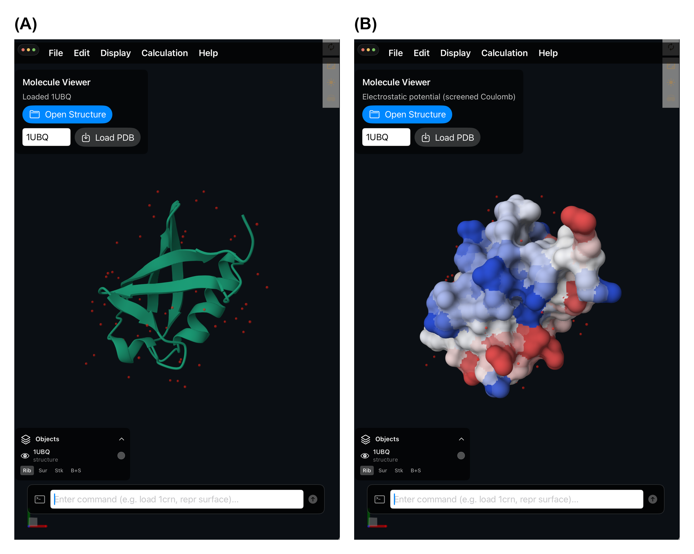

# MolApp: a native iPad molecular structure viewer with Apple Pencil interaction and on-device structural analysis

**Donghan Lee**\*

Korea Basic Science Institute (KBSI), Bio-NMR, Republic of Korea.

\*To whom correspondence should be addressed.

---

## Abstract

**Motivation:** iPads are portable and pen-capable, and are often used at the bench, in seminars and with collaborators without guaranteed connectivity, so interaction and computation that work offline are useful. Interactive inspection of macromolecular structures on tablets is nonetheless still dominated by web viewers that treat the touch screen as a mouse surrogate and offload analyses to remote services. Native iPad viewers exist (BioViewer, iMolview, the RCSB PDB Mobile app), but they reimplement rendering with a bespoke engine or act chiefly as PDB browsers, and compute structural analyses server-side or not at all. To our knowledge, no native iPadOS application reuses the Mol\* rendering engine itself and couples it with Apple Pencil interaction and self-contained on-device structural analyses.

**Results:** We present MolApp, a native iPadOS application that embeds the Mol\* rendering engine inside a SwiftUI shell through a narrow, typed Swift–JavaScript bridge. MolApp loads local PDB/mmCIF files and fetches entries directly from the RCSB by four-character PDB ID, driving them through Mol\*'s native rotate and pan camera control, with pinch-to-zoom bridged from a native gesture recognizer and an added double-tap-to-focus. A concise command line and a PyMOL-like selection language (`chain`, `res`, `resn`, `atom`, `model` combined with `&`, `|`, `!` and parentheses) sit alongside an Objects panel for per-structure representation, colour and visibility. Beyond visualization, MolApp runs four analyses entirely on-device: an approximate molecular-surface electrostatic potential (screened-Coulomb / Debye–Hückel), secondary-structure assignment via DSSP, sequence-alignment-guided iterative Cα superposition (Needleman–Wunsch followed by quaternion Kabsch fitting to the common core, computing RMSD and core size), and trajectory/NMR-ensemble morphing. The Apple Pencil adds hover residue identification and distance/angle/dihedral measurement by tapping 2/3/4 atoms.

**Availability and implementation:** MolApp is written in Swift/SwiftUI for iPadOS 18 or later and builds with Xcode against bundled, offline Mol\* assets. Source code is available at https://github.com/dleess/MolApp *[license to be specified]*.

**Contact:** kbsi.bionmr@gmail.com

---

## 1 Introduction

Molecular graphics on the desktop is mature: PyMOL (Schrödinger, 2015), UCSF ChimeraX (Pettersen *et al.*, 2021) and the web-native Mol\* viewer (Sehnal *et al.*, 2021) cover essentially every visualization and analysis need. On tablets the situation is thinner. Most tablet use of Mol\* or NGL (Rose *et al.*, 2018) happens through a browser, where interaction is inherited from the mouse-oriented web control scheme and analyses such as electrostatics or structural superposition are computed server-side. Native tablet viewers do exist — BioViewer¹, iMolview² and the RCSB PDB Mobile app³ — but they either reimplement rendering with a bespoke engine or act chiefly as PDB browsers, and on-device structural analysis is typically absent or delegated to a remote service.

iPads are portable, pen-capable and often used without guaranteed connectivity: they are carried to instruments, seminars and collaborators' offices, and the Apple Pencil affords direct on-screen pointing and hover. MolApp targets this gap. Rather than reimplement a renderer, it wraps the Mol\* WebGL engine in a native iPadOS application and adds what a browser cannot: iPadOS-native touch and Pencil interaction, and structural analyses that run locally without any external service. The contribution is combinatorial — to our knowledge MolApp is the first to reuse the Mol\* engine natively on iPadOS while coupling it with Apple Pencil interaction and self-contained on-device analysis — not a categorical "first molecular viewer for iPad".

## 2 Features and implementation

**Fig. 1.** MolApp on iPad. (A) PDB entry 1UBQ (Vijay-Kumar *et al.*, 1987) fetched by ID from the RCSB and shown as a Mol\* cartoon with water molecules; the Objects panel (lower left) gives per-structure visibility, colour and representation, and the bottom command line accepts a PyMOL-like language. (B) The same structure after the on-device `surfpot` command: a molecular surface coloured by a screened-Coulomb (APBS-like) electrostatic-potential proxy, computed locally with no external service.

**Architecture.** MolApp is a SwiftUI application that hosts a single full-screen `WKWebView` running Mol\* from bundled, offline assets (`viewer.html` plus the Mol\* JavaScript build); nothing is fetched from a CDN. Native controls communicate with the viewer through a deliberately minimal, typed bridge (`MolStarBridge`) whose command set is a fixed enumeration of seventeen cases — structure loading, representation, visibility, selection, focus, and the analysis commands below (Fig. 1). Each command is serialized as an `Encodable` envelope with a UUID and delivered to JavaScript by `evaluateJavaScript`; commands are queued and evaluated serially so that scripted actions execute in order, and the viewer posts selection, hover, measurement and result events back to Swift through a single `WKScriptMessageHandler`. Keeping the surface narrow makes the native and web layers independently testable.

**Loading and interaction.** Local `.pdb`, `.cif` and `.mmcif` files are opened through the iPad Files picker, read as UTF-8 and routed through a single `LocalStructureFileLoader` (`.pdb`→`pdb`, `.cif`/`.mmcif`→`mmcif`); a four-character PDB ID is validated and fetched as mmCIF (Bourne *et al.*, 1997) from the RCSB PDB (Berman *et al.*, 2000; Burley *et al.*, 2023) at `files.rcsb.org`. Only this RCSB fetch requires connectivity — local-file loading and all analyses run offline. Camera control is handled by Mol\* for rotate and pan: the host element sets `touch-action: none` and the `WKWebView` disables its scroll, zoom and back/forward gestures so these reach the engine unmodified. Pinch-to-zoom is instead captured by a native `UIPinchGestureRecognizer` and translated into Mol\* wheel/zoom events, and MolApp adds double-tap/double-click focus of the current selection. Multiple structures coexist; each appears in a collapsible Objects panel with independent visibility (eye), colour swatch and representation (Ribbon, Surface and Ball-and-Stick).

**Selection and command line.** A command field at the bottom of the screen accepts a compact language shared with the Objects panel. Selections are built from an expression grammar — `chain A`, `res 10-25`, `residue 42`, `atom CA`, `resn ALA`, `model N` — combined with `&`/`and`, `|`/`or`, `!`/`not` and parentheses, parsed by a small recursive-descent parser (OR over AND over NOT) and optionally named for reuse (e.g. `select core chain A & res 10-120`). Chain IDs preserve case, and a residue range such as `10-25` is distinguished from a negative residue number such as `-5`. All analyses and toggles are reachable both from this command line and from the graphical menus, so keyboard and touch workflows are interchangeable.

**On-device analyses.** Four analyses operate on the currently visible structures, requiring no network round-trip:

- *Surface potential* (`surfpot`) colours a molecular surface by a per-atom electrostatic-potential map computed as a screened-Coulomb / Debye–Hückel sum (Debye length ≈8 Å, ≈0.15 M ionic strength) with a distance floor. This is an APBS-like *proxy* (cf. Baker *et al.*, 2001), not a Poisson–Boltzmann solve: it assigns fixed formal charges to a small set of ionizable sidechain atoms and none others, uses a uniform implicit dielectric with no dielectric boundary or ion-exclusion layer, and normalizes colour to the 90th percentile of |ϕ|. Values are therefore relative and qualitative, not comparable in physical units across structures.
- *Secondary structure* (`ss`/`dssp`) applies a polymer-cartoon preset coloured by secondary structure, delegating the assignment itself to Mol\*, which uses model-provided annotations when present and otherwise runs its DSSP calculation (Kabsch and Sander, 1983; Touw *et al.*, 2015).
- *Superposition* (`super`) aligns each visible structure onto the first without requiring identical sequences: Cα chains are collapsed to one-letter sequences and aligned by Needleman–Wunsch (Needleman and Wunsch, 1970), then iteratively fit to the common structural core by a Kabsch-type least-squares superposition (Kabsch, 1976) solved with quaternions (Coutsias *et al.*, 2004), with distance-cutoff outlier rejection over successive rounds. It computes an RMSD over the surviving core (≥3 Cα pairs) and the core size; across multiple mobile structures the minimum RMSD and smallest core are computed.
- *Morph* (`morph`) plays through the models of a multi-model structure — an NMR ensemble or trajectory — via Mol\*'s built-in model-index animation. It is frame playback of pre-existing conformers, not a computed interpolation between end states.

**Apple Pencil.** On physical hardware, hovering the Pencil over an atom shows a residue-identity tooltip before selection (a native `UIHoverGestureRecognizer` forwards the point to Mol\*'s hover behaviour; the iOS Simulator emits no hover events). A measurement workflow lets the user choose Distance/Angle/Dihedral mode and tap 2/3/4 individual atoms to draw the measurement (ångströms for distance, degrees for angle and dihedral), accumulating sets until cleared. Each is also a command (`measure`, `measure angle`, `measure dihedral`, `measure clear`), so the Pencil and keyboard workflows remain interchangeable.

## 3 Conclusion

MolApp shows that a native tablet application can deliver molecular graphics together with offline structural analysis, using the Apple Pencil as a pointing device rather than a mouse stand-in. By wrapping Mol\* behind a narrow typed bridge it reuses that renderer while adding the iPadOS-native interaction and on-device electrostatics proxy, DSSP colouring, superposition and morphing that browser viewers lack. The analyses are deliberately lightweight approximations suited to interactive, offline use; more rigorous variants and screenshot annotation for marked-up figures are planned.

## Funding

*[Funding statement to be completed; state "This work received no specific grant from any funding agency" if none applies.]*

## Notes

1. BioViewer, Apple App Store, https://apps.apple.com/us/app/bioviewer/id1593006498
2. iMolview (Molsoft L.L.C.), https://www.molsoft.com/iMolview.html
3. RCSB PDB Mobile (RCSB Protein Data Bank), Apple App Store.

## References

Baker, N.A., Sept, D., Joseph, S. *et al.* (2001) Electrostatics of nanosystems: application to microtubules and the ribosome. *Proc. Natl. Acad. Sci. USA*, **98**, 10037–10041.

Berman, H.M., Westbrook, J., Feng, Z. *et al.* (2000) The Protein Data Bank. *Nucleic Acids Res.*, **28**, 235–242.

Bourne, P.E., Berman, H.M., McMahon, B. *et al.* (1997) Macromolecular Crystallographic Information File. *Methods Enzymol.*, **277**, 571–590.

Burley, S.K., Bhikadiya, C., Bi, C. *et al.* (2023) RCSB Protein Data Bank (RCSB.org): delivery of experimentally-determined PDB structures alongside one million computed structure models of proteins from artificial intelligence/machine learning. *Nucleic Acids Res.*, **51**, D488–D508.

Coutsias, E.A., Seok, C. and Dill, K.A. (2004) Using quaternions to calculate RMSD. *J. Comput. Chem.*, **25**, 1849–1857.

Kabsch, W. (1976) A solution for the best rotation to relate two sets of vectors. *Acta Crystallogr. A*, **32**, 922–923.

Kabsch, W. and Sander, C. (1983) Dictionary of protein secondary structure: pattern recognition of hydrogen-bonded and geometrical features. *Biopolymers*, **22**, 2577–2637.

Needleman, S.B. and Wunsch, C.D. (1970) A general method applicable to the search for similarities in the amino acid sequence of two proteins. *J. Mol. Biol.*, **48**, 443–453.

Pettersen, E.F., Goddard, T.D., Huang, C.C. *et al.* (2021) UCSF ChimeraX: structure visualization for researchers, educators, and developers. *Protein Sci.*, **30**, 70–82.

Rose, A.S., Bradley, A.R., Valasatava, Y. *et al.* (2018) NGL viewer: web-based molecular graphics for large complexes. *Bioinformatics*, **34**, 3755–3758.

Schrödinger, LLC (2015) *The PyMOL Molecular Graphics System*. Schrödinger, LLC, New York.

Sehnal, D., Bittrich, S., Deshpande, M. *et al.* (2021) Mol\* Viewer: modern web app for 3D visualization and analysis of large biomolecular structures. *Nucleic Acids Res.*, **49**, W431–W437.

Touw, W.G., Baakman, C., Black, J. *et al.* (2015) A series of PDB-related databanks for everyday needs. *Nucleic Acids Res.*, **43**, D364–D368.

Vijay-Kumar, S., Bugg, C.E. and Cook, W.J. (1987) Structure of ubiquitin refined at 1.8 Å resolution. *J. Mol. Biol.*, **194**, 531–544.
